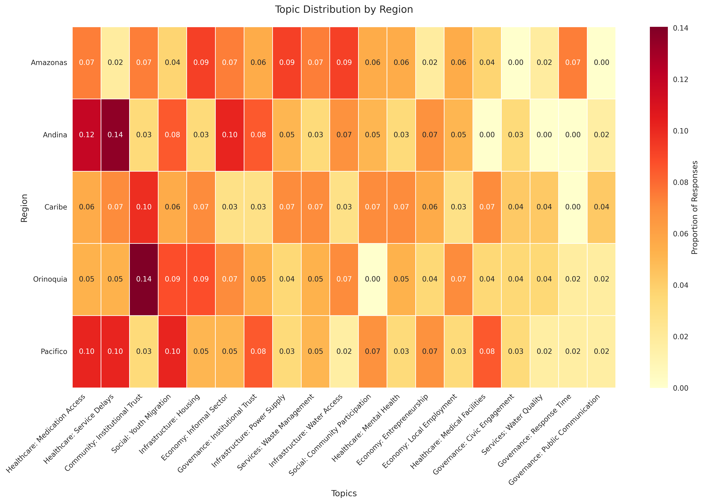
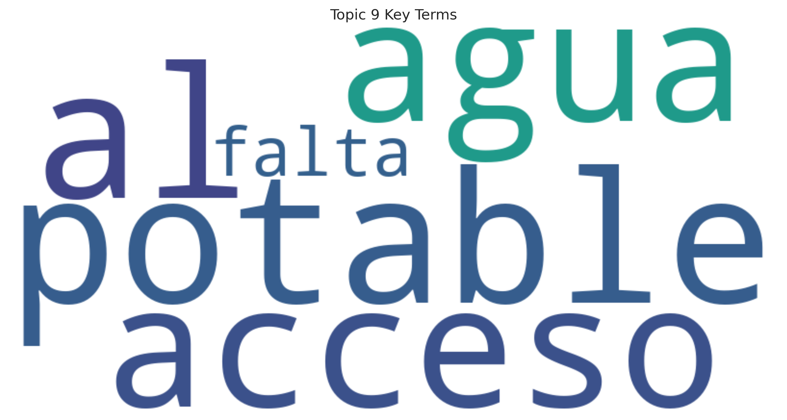
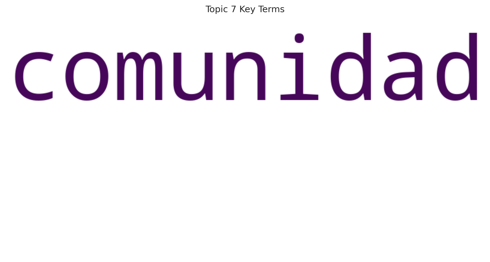
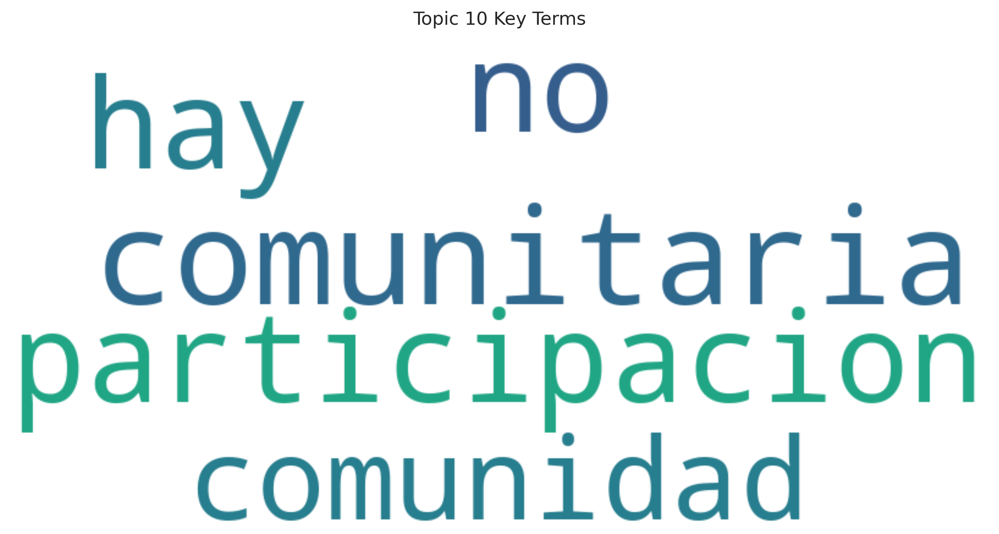
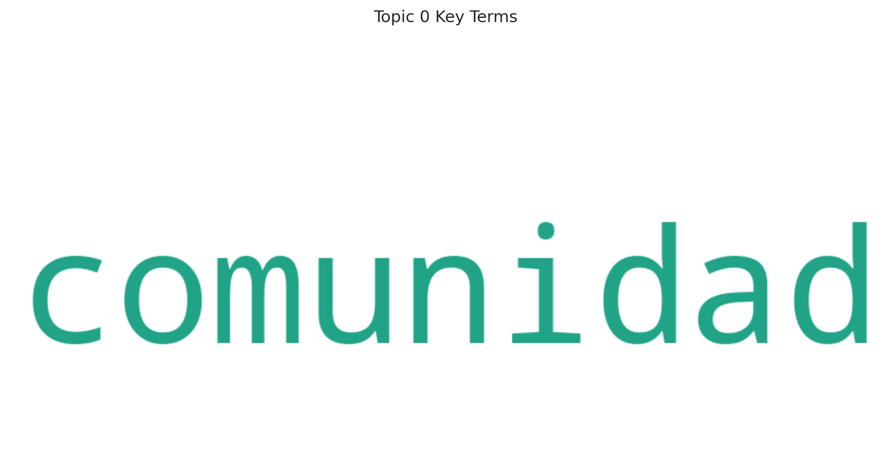
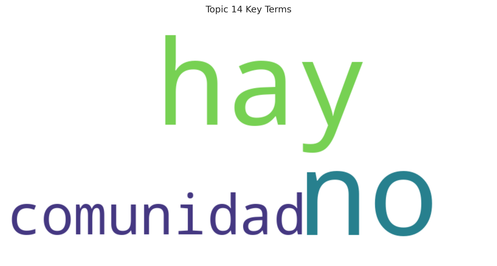
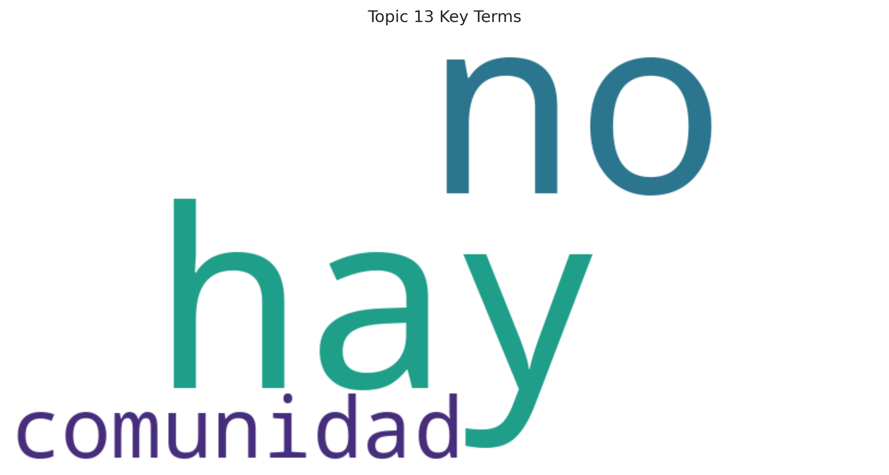

# 🔍 SurveyNLP Pipeline
> Automated Topic Analysis for Territorial Survey Data

[](https://github.com/afbeltranr/surveyNLP-policylab/actions)
[](https://www.python.org/downloads/)
[](https://maartengr.github.io/BERTopic/)

A modular NLP system that processes qualitative survey responses to extract structured insights for evidence-based policy making. Built with modern NLP techniques and continuous integration practices.

## 🎯 Overview


## 📊 Key Insights

### Topic Identification Guide

Below is a guide to help interpret the topics identified in the analysis:

| Category | Topic ID | Label | Key Issues |
|----------|----------|-------|------------|
| Healthcare | 0 | Medication Access | Essential medicine shortages |
| | 1 | Service Delays | Long waiting times for appointments |
| | 11 | Mental Health | Limited mental health services |
| | 14 | Medical Facilities | Distance to medical centers |
| Infrastructure | 4 | Housing | Poor housing conditions |
| | 7 | Power Supply | Frequent electricity outages |
| | 9 | Water Access | Limited access to clean water |
| | 16 | Water Quality | Potable water concerns |
| Economy | 5 | Informal Sector | Predominance of informal work |
| | 12 | Entrepreneurship | Lack of business support |
| | 13 | Local Employment | Limited job opportunities |
| Social | 3 | Youth Migration | Youth leaving for opportunities |
| | 10 | Community Participation | Low civic engagement |
| Governance | 2 | Institutional Trust | Community-government relations |
| | 6 | Institutional Trust | Lack of confidence in institutions |
| | 15 | Civic Engagement | Limited community participation |
| | 17 | Response Time | Slow institutional response |
| | 18 | Public Communication | Poor communication channels |
| Services | 8 | Waste Management | Inadequate waste collection |

This categorization helps organize the findings into meaningful themes for policy planning.

### Regional Topic Distribution


This heatmap shows how topics are distributed across different regions, with darker colors indicating higher prevalence. The values are normalized by region to show the proportion of responses within each area, making it easier to identify region-specific challenges and shared issues.

### Topic Distribution Overview


The bar chart above shows the distribution of responses across identified topics. Key topics include:
1. Access to Water and Basic Services (Topics 9, 16)
2. Community Participation (Topics 10, 15)
3. Healthcare Access (Topics 0, 14)
4. Infrastructure Issues (Topics 7, 8)
5. Institutional Response (Topics 17, 18)

### Population Group Analysis


This visualization shows how different population groups experience and report various challenges, highlighting potential disparities in access to services and resources across demographic segments.

### Topic Word Clouds
Below are word clouds showing the key terms associated with each topic:

<details>
<summary>Click to expand topic wordclouds</summary>

#### Basic Services & Infrastructure

Key theme: Water access and basic infrastructure


Key theme: Public utilities and service interruptions

#### Community & Participation

Key theme: Community participation and engagement


Key theme: Local governance and community organization

#### Healthcare & Social Services

Key theme: Healthcare access and medication availability


Key theme: Medical services and facilities

#### Economic Issues

Key theme: Employment and economic opportunities

</details>

### Representative Responses
Key responses identified for major topics:

| Topic Area | Representative Response | Common Across Regions |
|------------|------------------------|---------------------|
| Basic Services | "Falta de acceso al agua potable" | Yes |
| Healthcare | "No hay atención médica cerca" | Yes |
| Community | "No hay participación comunitaria" | No |
| Infrastructure | "Cortes de luz frecuentes" | Yes |
| Economic | "No hay empleo local" | Yes |

## 🛠 Technical Architecture


## 🔄 Pipeline Components

1. **Data Generation & Preprocessing**
   - Synthetic survey data generation
   - Text cleaning and standardization

2. **Topic Analysis**
   - BERTopic modeling
   - Semantic clustering
   - Topic labeling

3. **Insight Generation**
   - Regional distributions
   - Population group patterns
   - Topic summaries

4. **Quality Assurance**
   - Continuous Integration
   - Automated testing
   - Validation checkpoints

## 🚀 Quick Start

```bash
# Clone repository
git clone https://github.com/afbeltranr/surveyNLP-policylab.git

# Install dependencies
pip install -r requirements.txt

# Run pipeline
python main.py
```

## 📈 Results

Key topics identified from the survey responses:

1. 🏥 **Healthcare Access**
   - Mental health services are underserved (Topic 13)
   - Limited access to medical facilities (Topic 14)
   - Essential medication shortages (Topic 2)
   - Long appointment wait times (Topic 4)

2. 🏗 **Infrastructure Issues**
   - Frequent power outages (Topic 10)
   - Limited access to clean water (Topic 12)
   - Poor waste management (Topic 11)
   - Housing conditions need improvement (Topic 7)

3. 💼 **Economic Challenges**
   - Limited local employment opportunities (Topic 0)
   - Youth migration due to lack of opportunities (Topic 5)
   - Insufficient support for entrepreneurship (Topic 6)

4. 🤝 **Social Cohesion**
   - Low community participation (Topic 1)
   - Feelings of abandonment (Topic 3)
   - Lack of trust in institutions (Topic 9)

These insights suggest a need for:
- Improved healthcare infrastructure and access
- Infrastructure maintenance and development
- Economic development initiatives
- Community engagement programs 🇨🇴  
> Modular & Continuously Delivered NLP System for Qualitative Survey Analysis

This project simulates an automated NLP system that processes and summarizes qualitative territorial survey responses to support human-centered policy development. It emphasizes **flexible automation**, **human-in-the-loop validation**, and **modular CI/CD**, powered by **synthetic data** and scalable Python code.

---

### 📌 Key Features
- ✅ End-to-end ETL pipeline with continuous retraining
- 🧠 Topic modeling, clustering, and LLM-assisted classification
- ⚙️ TabM-style adapter ensemble experimentation
- 📊 Visual dashboards + policy-ready narratives
- 🔄 CI/CD with GitHub Actions (Bayesian-style update loop)

---

## 🧱 Project Structure

```
.
├── data/              # Synthetic raw and processed text
├── notebooks/         # Prototyping and EDA
├── src/               # Modular Python code (ETL, modeling, viz)
├── tests/             # CI/CD tests
├── .github/workflows/ # GitHub Actions workflows
└── main.py            # Entrypoint to run the full pipeline
```

---

## 🚧 Project Stages

> Each stage will include visuals and automation scripts. Status will update as we go!

### ✅ Stage 1: Corpus Creation & Taxonomy Design  

- Generate synthetic survey responses across diverse regions and groups
- Build initial taxonomic categories based on public policy themes  
<-- explain how categories and subcategories were selected from real-world policies -->

---

### ✅ Stage 2: Topic Modeling & Representation Learning  

- Use BERTopic, UMAP + HDBSCAN
- Embed TabM-style representation adapters (optional innovation layer)  
<-- explain adapter ensemble idea and why it's innovative for tabular NLP -->

---

### ✅ Stage 3: LLM-assisted Classification  

- GPT-based codification using few-shot prompts
- Validate vs. manual labels (simulation of expert input)  
<-- explain the importance of classification assist for edge cases -->

---

### ✅ Stage 4: Dashboards & Policy Narratives  

- Generate visuals by region, population group, and topic
- Summarize with quote banks and key insights  
<-- describe impact: how these visuals help decision makers -->

---

### ✅ Stage 5: CI/CD for Continuous Learning  

- GitHub Actions run tests + retrain model weekly or on new data
- Output updated reports + flag shifts in discourse  
<-- show automation diagram, link YAML workflow, explain Bayesian retraining metaphor -->

---

## 🛠 Tech Stack

- Python, pandas, spaCy
- BERTopic, SentenceTransformers
- GitHub Codespaces, GitHub Actions
- Dash / Plotly
- Optionally: OpenAI / GPT4All / TabM adapter module

---

## 🧪 Tests & Continuous Delivery

- `test_modeling.py` includes dummy tests for pipeline stability
- GitHub Actions in `.github/workflows/ci.yml` handles:
  - Install dependencies
  - Run tests
  - Retrain models
  - Save results to `outputs/` or trigger cloud export

---

## 📊 Diagrams (coming soon)

We'll include:
- End-to-end ETL Pipeline
- Human-in-the-loop Validation Flow
- GitHub Automation & Continuous Learning  
(*Use this space to embed PNGs or Mermaid diagrams*)

---

## 🧠 Why This Project Matters

This simulation reflects real-world NLP applications in public services, especially where **qualitative understanding** matters more than raw numbers. It merges **data science, automation, and social context**, preparing analysts to think beyond dashboards.

---

*📝 This README will evolve as stages progress and diagrams are created. All data is synthetic and used for educational purposes only.*
